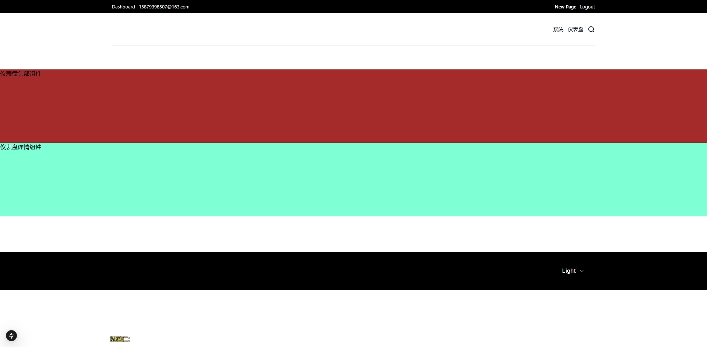

# [Payload](https://payloadcms.com/) Website Template（硬性要求 Node 版本 20 以上）

> 在官方 Website 项目上做的 Demo，添加了自定义 dashboard 页面。Poyload 核心原理：通过控制台配置属性，在前端组件中应用。前端页面开发是自由的，只有后台需要严格按照 [payload 文档](https://payloadcms.com/docs/configuration/overview)去配置。

> 小知识：Headless CMS 指的是，不限制前端用什么技术定制开发组件。研究 Payload 前置条件需要熟悉 [Next.js](https://nextjs.org/docs/app/getting-started) 的目录结构和基本操作！

！依赖安装和项目启动参考[官方安装文档](https://payloadcms.com/docs/getting-started/installation)

操作步骤：

1. 访问 `http://localhost:3000/admin` 配置页面组件和属性

2. 访问 `http://localhost:3000/dashboard` 查看展示效果

后台属性配置：

前端组件展示：

