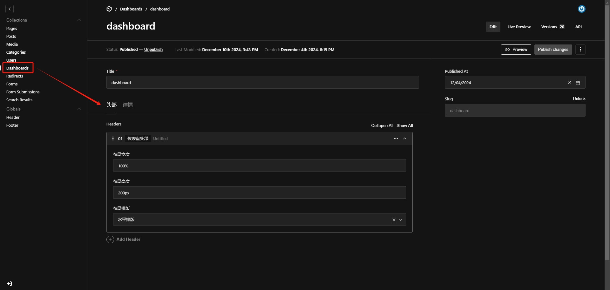

# Payload Website Template（硬性要求 Node 版本 20 以上）

> 在官方 Website 项目上做的 Demo，添加了自定义 dashboard 页面。Poyload 核心原理：通过控制台配置属性，在前端组件中应用。

> 小知识：Headless CMS 指的是，不限制前端用什么技术定制开发组件。

！依赖安装和项目启动参考官方安装文档

操作步骤：

1. 访问 `http://localhost:3000/admin` 配置页面组件和属性

2. 访问 `http://localhost:3000/dashboard` 查看展示效果

后台属性配置：

前端组件展示：

